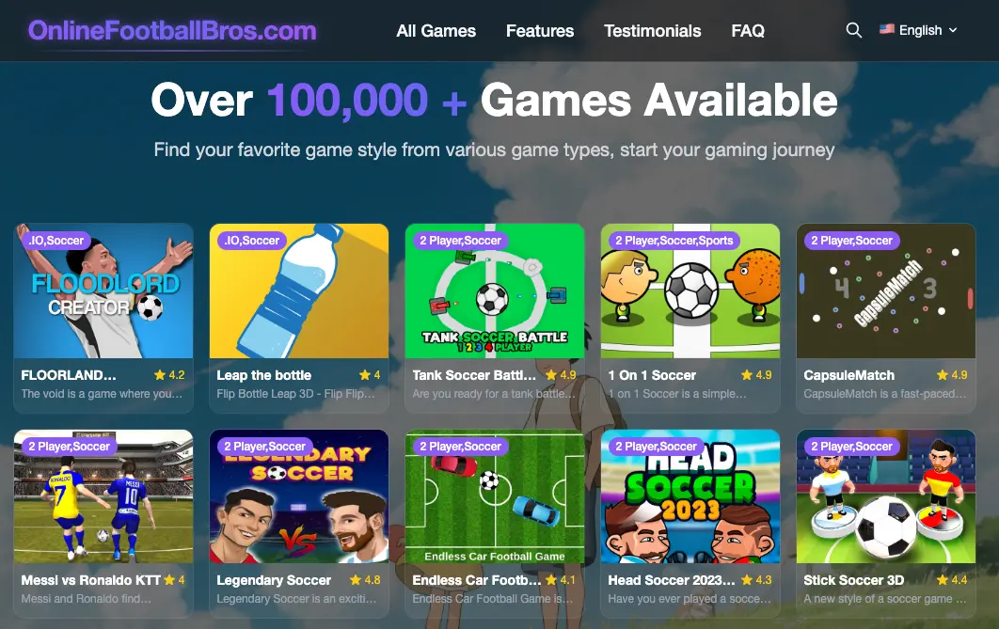

# Football Bros

[https://onlinefootballbros.com/](https://onlinefootballbros.com/)

> OnlineFootballBros is a platform that focuses on providing a variety of free online games, committed to providing players with a smooth and interesting gaming experience, and can play a variety of selected games without downloading.

## Core Content

- [Game Categories](https://onlinefootballbros.com/category): Browse all game categories and game lists
- [All Games](https://onlinefootballbros.com/category/All): View all games on the website
- [.IO Games](https://onlinefootballbros.com/category/.IO): Multiplayer online real-time battle games
- [Two-Player Games](https://onlinefootballbros.com/category/2%20Player): Cooperative or battle games designed specifically for two players
- [3D Games](https://onlinefootballbros.com/category/3D): Experience a selection of games with immersive 3D graphics
- [Action Games](https://onlinefootballbros.com/category/Action): Exciting games that challenge reaction speed and operating skills
- [Adventure Games](https://onlinefootballbros.com/category/Adventure): Adventure story games that explore a mysterious world
- [Arcade Games](https://onlinefootballbros.com/category/Arcade): Relive the classic arcade-style gaming experience
- [Baby Hazel Games](https://onlinefootballbros.com/category/Baby%20Hazel): Interactive game series for children
- [Bejeweled](https://onlinefootballbros.com/category/Bejeweled): Classic gem matching elimination game
- [Boys Games](https://onlinefootballbros.com/category/Boys): Various themed games designed specifically for boys
- [Clicker Games](https://onlinefootballbros.com/category/Clicker): Simple click-to-upgrade games
- [Cooking Games](https://onlinefootballbros.com/category/Cooking): Casual games that simulate the cooking process
- [Girls Games](https://onlinefootballbros.com/category/Girls): Various themed games designed specifically for girls
- [Hypercasual games](https://onlinefootballbros.com/category/Hypercasual): Easy-to-play casual games suitable for short-term play
- [Multiplayer games](https://onlinefootballbros.com/category/Multiplayer): Multiplayer mode for playing with friends or global players
- [Puzzle games](https://onlinefootballbros.com/category/Puzzle): Various intellectual challenge games to exercise the brain
- [Racing games](https://onlinefootballbros.com/category/Racing): Experience the speed and passion of racing games
- [Shooting games](https://onlinefootballbros.com/category/Shooting): Shooting games that test accuracy and reaction ability
- [Soccer games](https://onlinefootballbros.com/category/Soccer): Experience the fun and strategy of football
- [Sports Games](https://onlinefootballbros.com/category/Sports): Various sports simulation and competitive games
- [Stickman Games](https://onlinefootballbros.com/category/Stickman): Action-adventure games with stickman as the protagonist

## Popular game recommendations

- [Popular Game Zone](https://onlinefootballbros.com/): Selected popular games displayed on the homepage
- [Soccer Games](https://onlinefootballbros.com/category/Soccer): Experience the fun and strategy of football
- [Two-Player Games](https://onlinefootballbros.com/category/2%20Player): Cooperation or battle games designed specifically for two players
- [Hyper Casual Games](https://onlinefootballbros.com/category/Hypercasual): Simple and easy-to-use casual games suitable for short-term play

## Site Features

- [Game Search](https://onlinefootballbros.com/): Find your favorite games in the search box at the top of the homepage
- [Game Details](https://onlinefootballbros.com/game-detail/): View game introductions, operation methods and start games

## Latest Updates

- [New Game Categories](https://onlinefootballbros.com/category/): Regularly update game categories to provide more game choices
- [Platform Optimization](https://onlinefootballbros.com/): Continuously optimize website performance and user experience, updated in April 2025
- [Content Expansion](https://onlinefootballbros.com/category): Continuously add new games and update weekly

## Website Features

- No download required: All games run directly in the browser without installing any software
- Free to play: Provide a large number of free games, allowing users to enjoy the fun of games at any time
- Multi-device support: Adapt to multiple devices such as PC, tablets and mobile phones
- Clear classification: Detailed game classification helps users quickly find the game types they are interested in
- Continuous updates: Regularly update the game library to provide a fresh gaming experience
